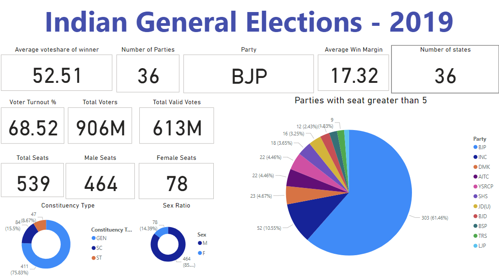

# Indian General Elections 2019 - Power BI Dashboard

## Overview

This repository hosts a Power BI dashboard visualization of the Indian General Elections held in 2019. The dashboard provides a comprehensive overview of various election metrics including voter turnout, total votes, party-wise seat distribution, and more.

### Hosted Dashboard

You can view the live dashboard [here](https://gowdavidwan2003.github.io/General-Elections-2019/).

## Features

- **Average Vote Share of Winner**: Shows the average percentage of votes received by winning candidates.
- **Number of Parties**: Total number of political parties that participated.
- **Winning Party**: The party with the majority seats.
- **Average Win Margin**: Average margin of victory in the elections.
- **Number of States**: Total number of states that participated.
- **Voter Turnout Percentage**: Percentage of eligible voters who cast their vote.
- **Total Voters**: Total number of registered voters.
- **Total Valid Votes**: Total number of valid votes cast.
- **Total Seats**: Total number of seats in the parliament.
- **Male Seats**: Number of seats won by male candidates.
- **Female Seats**: Number of seats won by female candidates.
- **Constituency Type**: Distribution of general, scheduled caste (SC), and scheduled tribe (ST) constituencies.
- **Sex Ratio**: Ratio of male to female seats.
- **Party-wise Seat Distribution**: Number of seats won by each party with more than five seats.

## Developer

- **Name**: Vidwan Gowda H M
- **Email**: [your-email@example.com](mailto:gowdavidwan2003@gmail.com)
- **GitHub**: [github.com/gowdavidwan2003](https://github.com/gowdavidwan2003)
- **LinkedIn**: [linkedin.com/in/gowdavidwan2003](https://linkedin.com/gowdavidwan2003)

## Usage

To explore the dashboard, visit the hosted link and interact with the various visual elements to gain insights into the 2019 Indian General Elections.

## Repository Contents

- `index.html`: The main HTML file hosting the embedded Power BI report.
- `README.md`: This file.

## License

This project is licensed under the MIT License - see the [LICENSE](LICENSE) file for details.
